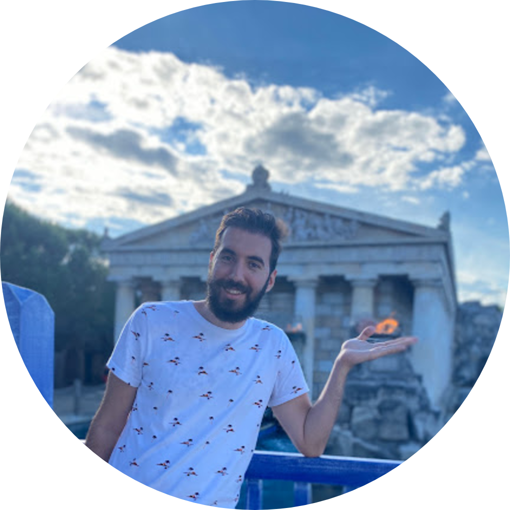

## About Me

Arlind Kadra is a Postdoctoral Researcher at the University of Technology Nuremberg, where he is working on automated machine learning, tabular foundation models, hyperparameter optimization, and meta-learning.
Arlind received his Ph.D. in Computer Science from the same lab, where his dissertation focused on efficient, automated, and explainable deep learning systems.

## Publications
For an up-to-date publication record, please check out my [Google Scholar](https://scholar.google.com/citations?user=bMa0KUcAAAAJ&hl=en) profile.

## Selected Publications

1. **A. Kadra**, S. Pineda Arango, J. Grabocka, Interpretable Mesomorphic Networks for Tabular Data, *NeurIPS 2024*, [[pdf](https://proceedings.neurips.cc/paper_files/paper/2024/file/3848856978da28639d2057094a1287a5-Paper-Conference.pdf)]

2. S. Pineda Arango, F. Ferreira, **A. Kadra**, F. Hutter, J. Grabocka, Quick-Tune: Quickly Learning Which Pretrained Model to Finetune and How, *ICLR 2024 (Oral, Top 1.2%)*, [[pdf](https://openreview.net/pdf?id=tqh1zdXIra)]

3. **A. Kadra**, M. Janowski, M. Wistuba, J. Grabocka, Scaling Laws for Hyperparameter Optimization, *NeurIPS 2023*, [[pdf](https://proceedings.neurips.cc/paper_files/paper/2023/file/945c781d7194ea81026148838af95af7-Paper-Conference.pdf)]

4. M. Wistuba, **A. Kadra**, J. Grabocka, Supervising the Multi-Fidelity Race of Hyperparameter Configurations, *NeurIPS 2022*, [[pdf](https://proceedings.neurips.cc/paper_files/paper/2022/file/57b694fef23ae7b9308eb4d46342595d-Paper-Conference.pdf)]

5. **A. Kadra**, M. Lindauer, F. Hutter, J. Grabocka, Well-Tuned Simple Nets Excel on Tabular Datasets, *NeurIPS 2021*, [[pdf](https://proceedings.neurips.cc/paper_files/paper/2021/file/c902b497eb972281fb5b4e206db38ee6-Paper.pdf)]

6. Feurer, J. N. Van Rijn, **A. Kadra**, P. Gijsbers, N. Mallik, S. Ravi, A. Müller, J. Vanschoren, F. Hutter, OpenML-Python: an Extensible Python API for OpenML, *JMLR 2021*, [[pdf](https://www.jmlr.org/papers/volume22/19-920/19-920.pdf)]

## Coding and Open-Sourcing

* **[Auto-Pytorch](https://github.com/automl/Auto-PyTorch)**, Python package (*pip install autoPyTorch*) with over 2.5k stars on GitHub, for automated machine learning (AutoML) with deep learning methods for tabular data, image data, and time series data. 
* **[OpenML-Python](https://github.com/openml/openml-python)**, Python package (*pip install openml*) for easy access to the OpenML platform, which provides a large collection of datasets, machine learning tasks, and experiments. The package allows users to easily download datasets, run machine learning algorithms, and share their results with the community.
* **[OpenML-Java](https://github.com/openml/openml-java)**, Java package for easy access to the OpenML platform, which provides a large collection of datasets, machine learning tasks, and experiments. The package allows users to easily download datasets, run machine learning algorithms, and share their results with the community.

{::comment}
## Talks
+ __Talk at Max Plank Institute for Intelligent Systems (09/19)__ 
I gave a [talk](https://ps.is.tuebingen.mpg.de/talks/learning-visual-dynamics-models-of-rigid-objects-using-relational-inductive-biases) about my work at the Perceiving Systems department

+ __Presentation on Graph Networks (01/19)__ 
I gave an introduction to Graph Networks in a lab meeting at IPRL [[slides](https://www.dropbox.com/sh/dnjnjggevvxo8jl/AAA5B2f7QP7LW7YIqjYeElvia?dl=0)]

+ __Speaker at the Deep Learning Student Talk (11/16)__  
Invited speaker at the "[Deep Learning Student Talk](https://ferreirafabio.github.io/data/posterdl.pdf)" at the Karlsruhe University of Applied Sciences, presentation and discussion about my Bachelor thesis on CNNs

## Other
+ __Advising and Co-advising two Bachelor theses at SAP SE and Daimler AG (2019)__ 

+ __Visiting Lecturer for a Machine Learning introductory course at Baden-Wuerrtemberg Cooperative State University__ 
from May 2018 until August 2018 along with a fellow student I will be lecturing a machine learning introductory class for business information systems degree students at Baden-Wuerrtemberg Cooperative State University (DHBW Karlsruhe). [[lecture material](https://github.com/ferreirafabio/Intro_to_ML_DHBW)]
{:/comment}

{::comment}
## Publications

1. F.Bar, J.Doe: Effects of having a placeholder of a name
2. S.Holmes, J.Watson: Consequences of living with a sociopath in London

## Typography

This is a [link](http://google.com). Something *italics* and something **bold**.

Here is a table

Year | Award | Category
-----|-------|--------
2014 | Emmy  | Won Outstanding Lead Actor in a miniseries or a movie
2015 | BAFTA | Nominated for Best Leading Actor for Sherlock
2014 | Satellite | Won Best Actor miniseries or television film

Here is a horizontal rule

---

Here is a blockquote

> To a great mind, nothing is little

## References

* Foo Bar: Head of Department, Placeholder Names, Lorem
* John Doe: Associate Professor, Department of Computer Science, Ipsum
{:/comment}
